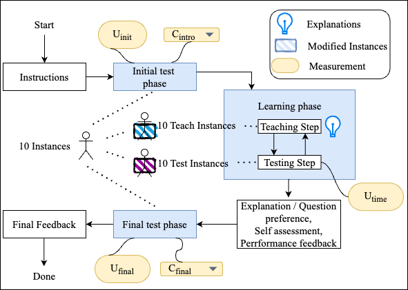

# Frontend for paper: Measuring User Understanding in Dialogue based xAI Systems

The frontend contains the experiment flow from introducing the user, showing the agreement form and
performing the three experiment phases. The experiment phases are shown below:

- Instructions: src/routes/intro
- Blue Boxes: src/routes/experiment
- Final Feedback: src/routes/exit

## Installation

### Requirements

- node version 18.14.1

### How to run locally

1. npm install
2. start the
   backend [python server](https://github.com/dimitrymindlin/Measuring-User-Understanding-in-Dialogue-based-XAI-Systems.git)
3. npm run dev

### Running in Docker

Docker compose is set up to start database and frontend.

## Problems

### backend endpoint is hardcoded

The backend endpoint is hardcoded in the file `/src/lib/settings.ts` -> BACKEND.
